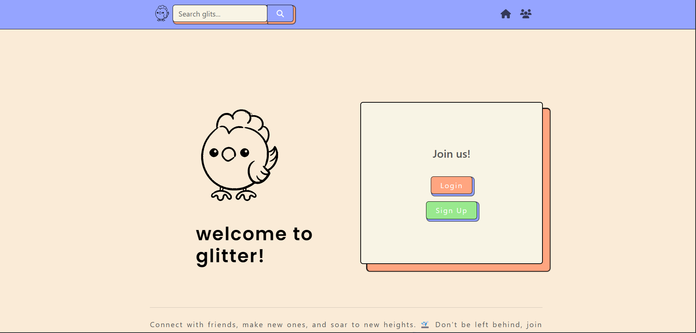

# ✨ Glitter - Plataforma de Micro-contenido

> Aplicación fullstack de red social tipo Twitter, desarrollada con Vue 3, Express y MongoDB.

[](https://vuejs.org/)
[](https://expressjs.com/)
[](https://www.mongodb.com/)
[](https://vuex.vuejs.org/)

---

## 🎨 Preview

<div align="center">
  
  <p><em>Página de bienvenida de Glitter</em></p>
</div>

---

## 🚀 Inicio Rápido

### Opción 1: Script Automático (Recomendado)

**Windows:**
```bash
# 1. Iniciar MongoDB (PowerShell como Admin)
net start MongoDB

# 2. Ejecutar script
start-dev.bat
```

**Mac/Linux:**
```bash
./start-dev.sh
```

### Opción 2: Manual

```bash
# Terminal 1 - Backend
cd Glitter-api
pnpm install && pnpm run init-db && pnpm start

# Terminal 2 - Frontend
cd Glitter-Vue
pnpm install && pnpm dev
```

**Abre:** http://localhost:8080

---

## 📚 Documentación

### 🎯 Manuales de Uso

| Documento | Tiempo | Descripción |
|-----------|--------|-------------|
| **[⚡ Inicio Rápido](docs/QUICK-START.md)** | 5 min | Configuración rápida |
| **[📦 Instalación](docs/INSTALACION.md)** | 20 min | Guía completa paso a paso |
| **[🐛 Troubleshooting](docs/TROUBLESHOOTING.md)** | - | Solución de problemas |
| **[🗄️ MongoDB Windows](docs/MONGODB-WINDOWS.md)** | 10 min | Guía para Windows |

### 📖 Documentación Técnica

| Documento | Contenido |
|-----------|-----------|
| **[🏗️ Arquitectura](docs/ARQUITECTURA.md)** | Diseño del sistema + Mejoras v2.0 |
| **[📡 API Reference](docs/API.md)** | Endpoints, ejemplos y modelos |
| **[🔍 Búsqueda](docs/BUSQUEDA.md)** | Sistema de búsqueda de texto |

### 📋 Navegación Visual

**[📚 DOCUMENTACION.md](DOCUMENTACION.md)** ← Índice completo con guías
| **[🔍 Búsqueda](docs/BUSQUEDA.md)** | Funcionalidad de búsqueda |

---

## 🏗️ Estructura del Proyecto

```
📦 Glitter-FullStack-Social-Media-Project-Express-Vue
│
├── 🎨 Glitter-Vue/              Frontend (Vue 3 + Vuex) - Puerto 8080
│   ├── src/
│   │   ├── components/          Componentes reutilizables
│   │   ├── views/               Páginas/Vistas
│   │   ├── router/              Configuración de rutas
│   │   ├── store/               Vuex store (auth, notifications, search)
│   │   └── api/                 Cliente HTTP (Axios)
│   └── [README](Glitter-Vue/README.md)
│
├── ⚙️ Glitter-api/              Backend (Express + MongoDB) - Puerto 3000
│   ├── routes/                  Endpoints de la API
│   ├── models/                  Modelos de MongoDB
│   └── [README](Glitter-api/README.md)
│
├── 📁 docs/                     Documentación
├── 🚀 start-dev.bat             Script de inicio (Windows)
├── 🚀 start-dev.sh              Script de inicio (Mac/Linux)
└── 💻 glitter-workspace.code-workspace
```

---

## 🛠️ Stack Tecnológico

### Frontend
- **Vue 3** (Composition API) - Framework progresivo
- **Vuex 4** - Gestión de estado global
- **Vue Router 4** - Navegación SPA
- **Axios** - Cliente HTTP
- **Bootstrap** - Estilos y componentes

### Backend
- **Node.js** - Runtime de JavaScript
- **Express.js** - Framework web
- **MongoDB** - Base de datos NoSQL
- **Mongoose** - ODM para MongoDB
- **JWT** - Autenticación
- **Multer** - Upload de archivos

### Desarrollo
- **Vite 6** - Build tool ultrarrápido
- **pnpm** - Gestor de paquetes seguro y eficiente
- **ESLint** - Linter de código
- **Claude Sonnet 4.5** - Asistencia en desarrollo y documentación

---

## 🎯 Funcionalidades

### Autenticación
- ✅ Registro de usuarios con validación
- ✅ Login con JWT
- ✅ Recuperación de contraseña
- ✅ Protección de rutas
- ✅ Estado global reactivo

### Publicaciones (Glits)
- ✅ Crear glits con texto e imágenes
- ✅ Feed público y privado
- ✅ Sistema de kudos (likes)
- ✅ Eliminar glits propios
- ✅ **Búsqueda de texto completo**

### Social
- ✅ Seguir/dejar de seguir usuarios
- ✅ Feed personalizado (usuarios seguidos)
- ✅ Perfiles de usuario
- ✅ Búsqueda de usuarios

### UX
- ✅ Diseño responsive
- ✅ Notificaciones animadas
- ✅ Modales de confirmación
- ✅ Feedback visual en todas las acciones
- ✅ Navbar reactiva

---

## 📋 Requisitos Previos

- **Node.js** v14+ - [Descargar](https://nodejs.org/)
- **MongoDB** v4+ - [Descargar](https://www.mongodb.com/try/download/community)
- **pnpm** - Gestor de paquetes para todo el monorepo

**Verificar instalaciones:**
```bash
node --version
npm --version
mongod --version
```

---

## 🔧 Comandos Principales

### Backend (Glitter-api)
```bash
pnpm install             # Instalar dependencias
pnpm run init-db         # Inicializar base de datos
pnpm run create-search-index  # Crear índice de búsqueda
pnpm start               # Iniciar servidor (puerto 3000)
```

### Frontend (Glitter-Vue)
```bash
pnpm install         # Instalar dependencias
pnpm dev             # Servidor de desarrollo (puerto 8080)
pnpm build           # Build de producción
pnpm lint            # Linter
```

---

## 📡 API Endpoints Principales

**Base URL:** `http://localhost:3000`

### Autenticación
- `POST /auth/register` - Registrar usuario
- `POST /auth/login` - Iniciar sesión (devuelve JWT)
- `GET /auth/verify-token` - Verificar token

### Publicaciones
- `GET /glits/` - Listar glits públicos
- `GET /glits?search=término` - **Buscar glits**
- `GET /glits/private` - Feed personalizado [AUTH]
- `POST /glits/` - Crear glit [AUTH]
- `DELETE /glits/:id` - Eliminar glit [AUTH]
- `POST /glits/:id/kudos` - Dar kudos [AUTH]

### Usuarios
- `POST /users/:id/follow` - Seguir usuario [AUTH]
- `DELETE /users/:id/follow` - Dejar de seguir [AUTH]

📖 **Documentación completa:** [API Reference](docs/API.md)

---

## 💻 Desarrollo con VS Code

### Abrir Workspace
```bash
code glitter-workspace.code-workspace
```

### Extensiones Recomendadas
- ESLint
- Prettier
- Volar (Vue 3)
- MongoDB for VS Code

### Debugging
Presiona `F5` → Selecciona "🌟 Fullstack: Backend + Frontend"

---

## 🐛 Solución de Problemas

### MongoDB no se conecta
```bash
# Windows
net start MongoDB

# Mac
brew services start mongodb-community
```
📖 **Guía completa:** [MongoDB en Windows](docs/MONGODB-WINDOWS.md)

### Puerto ocupado
```bash
# Windows
netstat -ano | findstr :3000
taskkill /PID <PID> /F

# Mac/Linux
lsof -ti:3000 | xargs kill -9
```

### Más problemas
📖 Ver [Solución de Problemas](docs/TROUBLESHOOTING.md)

---

## 👥 Equipo

Desarrollado por **No-Woman-No-Work**:
- Andrea Ares Fernandez
- Emma Alonso McCoy
- Nelanyi Ruiz Contreras
- Silvia Pescador López
- Mariana Antoniol

**Asistencia técnica:** Claude Sonnet 4.5 (Anthropic)

---

## 📄 Licencia

ISC License

---

## 🔗 Enlaces

- [Backend Repository](https://github.com/No-Woman-No-Work/Glitter-api)
- [Frontend Repository](https://github.com/No-Woman-No-Work/Glitter-Vue)
- [Documentación Vue 3](https://vuejs.org/)
- [Documentación Express](https://expressjs.com/)
- [Documentación MongoDB](https://docs.mongodb.com/)

---

## 🆘 Ayuda

¿Problemas? Consulta en orden:
1. [Inicio Rápido](docs/QUICK-START.md)
2. [Solución de Problemas](docs/TROUBLESHOOTING.md)
3. [Instalación Detallada](docs/INSTALACION.md)

---

<div align="center">

**¡Feliz desarrollo con Glitter! ✨**

Proyecto desarrollado como parte del Women in Tech Bootcamp

[Inicio Rápido](docs/QUICK-START.md) • [Documentación](docs/) • [Reportar Bug](https://github.com/No-Woman-No-Work/Glitter-api/issues)

</div>
